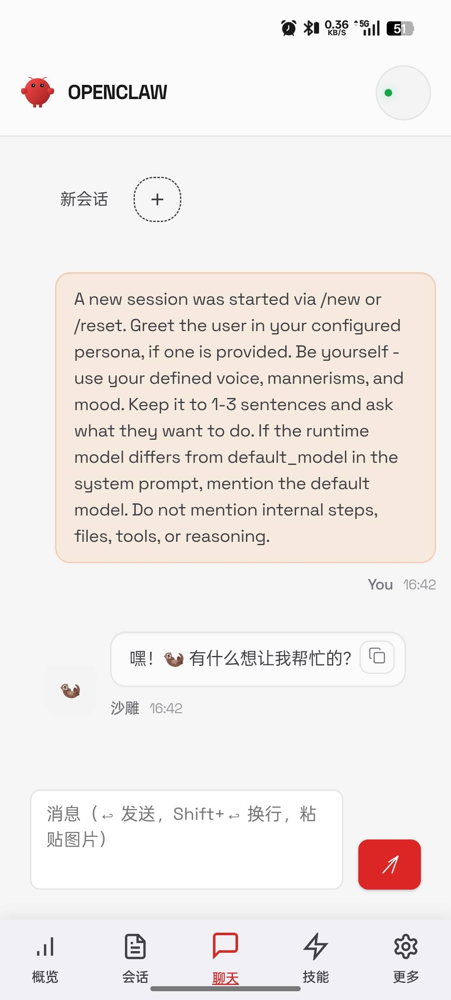
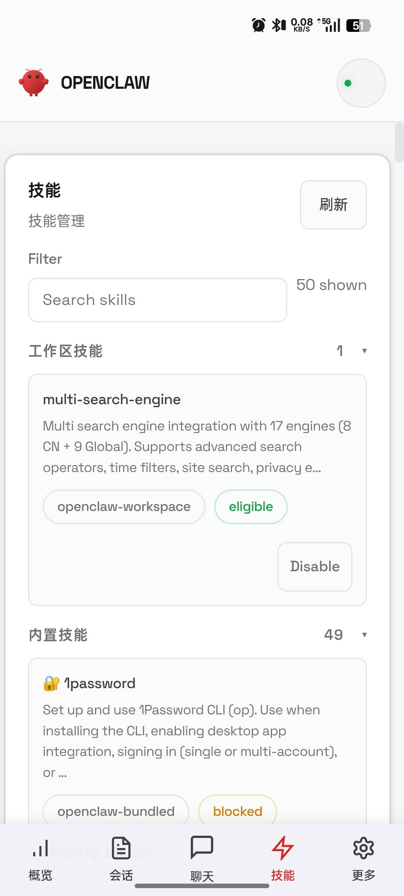
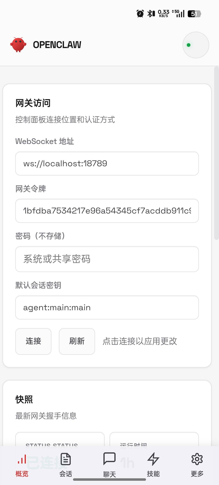

# OpenClaw Mobile

OpenClaw Android 移动应用，基于 Capacitor/WebView 技术构建。

## 软件预览

| 概览 | 会话 |
|------|------|
|  |  |

| 聊天 | 配置 |
|------|------|
|  |  |

## 功能特性

### 核心功能
- **概览** - 网关连接配置（WebSocket 地址、令牌）
- **实时聊天** - 与 AI 助手进行对话交互
- **会话管理** - 管理多个对话会话，支持设置思考模式、推理级别
- **技能市场** - 浏览和安装各种技能
- **配置管理** - 完整的 OpenClaw 网关配置界面

### 移动端优化
- 响应式布局，适配手机屏幕
- 底部导航栏
- 触摸友好的交互设计
- 聊天窗口优化（会话标签栏、图标化发送按钮）
- 表格横向滚动支持

### 界面翻译
- 完整中文界面
- 配置页面字段翻译（设备配对、网关、模型、认证等）

## 技术架构

```
┌─────────────────────────────────────┐
│         OpenClaw Mobile            │
│  (Android WebView + Capacitor)     │
├─────────────────────────────────────┤
│  ┌─────────────────────────────┐    │
│  │      Control UI (Web)      │    │
│  │  - Chat / Sessions / Skills│    │
│  │  - Config / Overview       │    │
│  └─────────────────────────────┘    │
├─────────────────────────────────────┤
│  ┌─────────────────────────────┐    │
│  │     Capacitor Bridge      │    │
│  └─────────────────────────────┘    │
├─────────────────────────────────────┤
│  ┌─────────────────────────────┐    │
│  │   OpenClaw Gateway         │    │
│  │   (WebSocket:18789)       │    │
│  └─────────────────────────────┘    │
└─────────────────────────────────────┘
```

### 技术栈
- **前端框架**：Lit + TypeScript
- **移动端框架**：Capacitor
- **构建工具**：Vite + Gradle
- **目标平台**：Android

## 使用方式

### 1. 安装 APK

从 [Releases](https://github.com/lg31415/openclaw-mobile/releases) 下载最新 APK 文件，安装到 Android 设备。

### 2. 配置连接

首次启动后，需要配置网关地址：

1. 在"概览"页面填写 WebSocket 地址
   - 默认：`ws://localhost:18789`（需要网关运行在同一网络）
   - 远程：`ws://你的网关IP:18789`

2. 填写网关令牌（TOKEN）
   - 在网关配置中获取

3. 点击"保存"连接

### 3. 开始使用

连接成功后即可使用：
- **概览** - 查看和配置网关连接
- **聊天** - 与 AI 助手对话
- **会话** - 管理对话历史、设置思考模式
- **技能** - 安装和管理技能
- **配置** - 调整系统设置

## 部署方式

### 部署 OpenClaw 网关

网关需要部署在你的服务器或电脑上：

```bash
# 使用 Docker
docker run -d -p 18789:18789 openclaw/gateway

# 或直接运行
openclaw gateway start
```

### 网络配置

- **本地连接**：手机和网关在同一 WiFi 下，使用局域网 IP
- **远程连接**：网关有公网域名或 IP，可远程访问

## 编译方式

### 环境要求

- JDK 17+
- Android SDK
- Gradle

### 编译

#### macOS / Linux
```bash
./gradlew assembleDebug
```

#### Windows
```cmd
gradlew.bat assembleDebug
```

APK 输出位置：`app/build/outputs/apk/debug/app-debug.apk`

## 自动构建

GitHub Actions 自动构建，查看 [Actions](https://github.com/lg31415/openclaw-mobile/actions) 页面。

- 每次 push 自动构建
- 在 Actions 页面下载 Artifacts
- 创建 Release 时自动上传 APK

## 项目结构

```
openclaw-mobile/
├── app/                    # Android 应用源码
│   └── src/main/
│       └── assets/        # Web 资源
├── screenshots/           # 软件截图
├── .github/
│   └── workflows/        # GitHub Actions
└── README.md
```

## 许可证

MIT License
